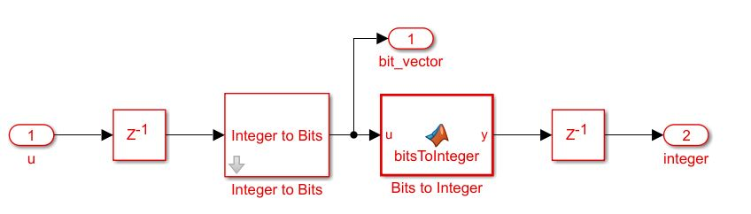

# HDL-Bit-Operations
Sample models to do various bitwise operations suitable for HDL Code Generation

Attached model shows how to convert a word to bits and bits to word using MATLAB Function Block.

